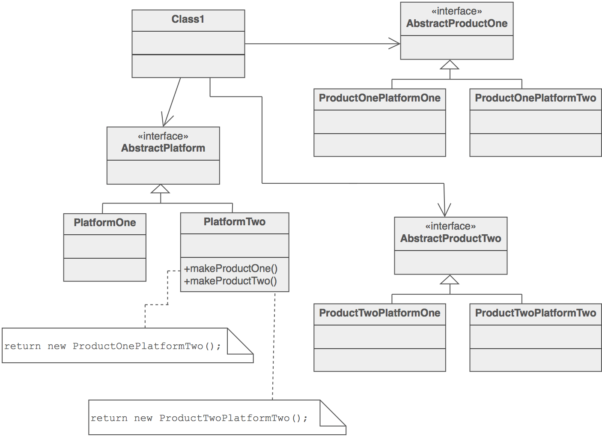
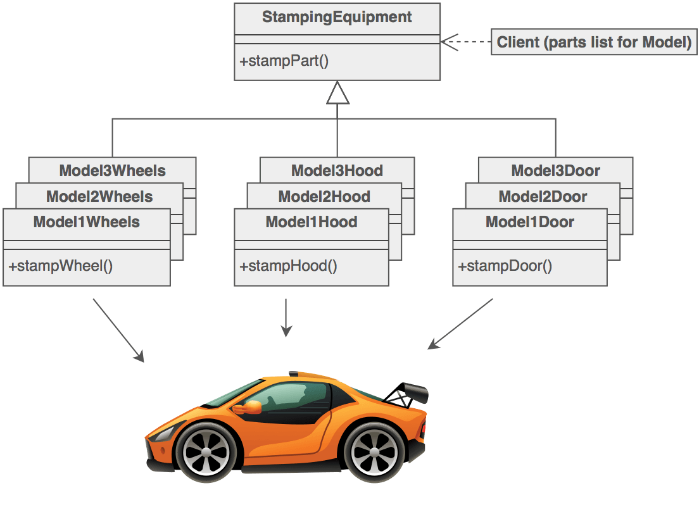

# 抽象工厂模式

### 目的

- 提供用于创建相关或相近对象的接口，而无需指定其具体类.
- 封装的层次结构: 一套"产品", 多个"平台".
- new 操作有副作用.

### 问题

如果应用程序是可移植的, 则需要封装平台依赖项. 这些"平台"可能包括: 窗口系统, 操作系统, 数据库等. 通常, 这种封装不是事先设计的, 并且许多带有所有当前支持平台选项的 #if 判断语句开始使整个代码迅速膨胀.

### 讨论

提供一个间接层, 用于抽象相关或依赖对象的创建, 而无需直接指定其具体类. "工厂"对象负责为整个平台系列提供创建服务. 客户从不直接创建平台对象, 他们要求工厂为他们做这件事.

这种机制使得交换产品系列变得容易, 因为工厂对象的特定类在应用程序中只出现一次 - 它被实例化. 应用程序可以简单地通过实例化抽象工厂的不同具体实例来批量替换整个产品系列.

因为工厂对象提供的服务是如此普遍, 所以它通常被实现为单例.

### 结构

抽象工厂为每个产品定义工厂方法. 每个工厂方法都封装了新的操作符和具体的, 特定于平台的产品类. 然后使用工厂派生类对每个"平台"进行建模.



### 示例

抽象工厂的目的是提供一个用于创建相关对象的接口, 而无需指定具体的类. 这种图案存在于日本汽车制造中使用的金属板冲压设备中. 冲压设备是一个抽象工厂, 创造汽车车身零件. 对于不同型号的汽车, 同样的机械用于标记右侧车门, 左侧车门, 右前挡泥板, 左前挡泥板, 发动机罩等. 通过使用滚轮更换冲压模具, 机器生产的混凝土等级可在三分钟内更换.



### 检查清单

1. 决定"平台独立性"和创作服务是否是当前的痛苦根源.
2. 绘制出"平台"与"产品"的矩阵.
3. 定义工厂接口, 其中包含每个产品的工厂方法.
4. 为每个平台定义一个工厂派生类, 该类封装了对 new 运算符的所有引用.
5. 客户端应该停用对 new 的所有引用, 并使用工厂方法来创建产品对象.

### 经验法则

- 有时创作模式是有竞争关系的: 有些情况下原型或抽象工厂可以有利可图. 在其他时候它们是互补的: Abstract Factory可能存储一组原型来克隆和返回产品对象, Builder可以使用其他模式之一来实现构建哪些组件. Abstract Factory, Builder和Prototype可以在其实现中使用Singleton.
- Abstract Factory, Builder和Prototype定义了一个工厂对象, 它负责了解和创建产品对象的类, 并使其成为系统的参数. Abstract Factory具有生成多个类对象的工厂对象. Builder使用相应复杂的协议使工厂对象逐步构建复杂产品. Prototype具有通过复制原型对象来构建产品的工厂对象(也称为原型).
- 抽象工厂类通常使用工厂方法实现，但也可以使用Prototype实现.
- Abstract Factory可以用作Facade的替代方法来隐藏特定于平台的类.
- Builder专注于逐步构建复杂对象. Abstract Factory强调一系列产品对象(简单或复杂). Builder将产品作为最后一步返回, 但就Abstract Factory而言, 产品会立即返回.
- 通常, 设计开始使用工厂方法(不太复杂, 可定制, 子类增加), 并逐渐向抽象工厂, 原型或构建器发展(更灵活, 更复杂), 因为设计师发现需要更多灵活性的地方.


### Code
```python
"""
Provide an interface for creating families of related or dependent
objects without specifying their concrete classes.
"""

import abc


class AbstractFactory(metaclass=abc.ABCMeta):
    """
    Declare an interface for operations that create abstract product
    objects.
    """

    @abc.abstractmethod
    def create_product_a(self):
        pass

    @abc.abstractmethod
    def create_product_b(self):
        pass


class ConcreteFactory1(AbstractFactory):
    """
    Implement the operations to create concrete product objects.
    """

    def create_product_a(self):
        return ConcreteProductA1()

    def create_product_b(self):
        return ConcreteProductB1()


class ConcreteFactory2(AbstractFactory):
    """
    Implement the operations to create concrete product objects.
    """

    def create_product_a(self):
        return ConcreteProductA2()

    def create_product_b(self):
        return ConcreteProductB2()


class AbstractProductA(metaclass=abc.ABCMeta):
    """
    Declare an interface for a type of product object.
    """

    @abc.abstractmethod
    def interface_a(self):
        pass


class ConcreteProductA1(AbstractProductA):
    """
    Define a product object to be created by the corresponding concrete
    factory.
    Implement the AbstractProduct interface.
    """

    def interface_a(self):
        pass


class ConcreteProductA2(AbstractProductA):
    """
    Define a product object to be created by the corresponding concrete
    factory.
    Implement the AbstractProduct interface.
    """

    def interface_a(self):
        pass


class AbstractProductB(metaclass=abc.ABCMeta):
    """
    Declare an interface for a type of product object.
    """

    @abc.abstractmethod
    def interface_b(self):
        pass


class ConcreteProductB1(AbstractProductB):
    """
    Define a product object to be created by the corresponding concrete
    factory.
    Implement the AbstractProduct interface.
    """

    def interface_b(self):
        pass


class ConcreteProductB2(AbstractProductB):
    """
    Define a product object to be created by the corresponding concrete
    factory.
    Implement the AbstractProduct interface.
    """

    def interface_b(self):
        pass


def main():
    for factory in (ConcreteFactory1(), ConcreteFactory2()):
        product_a = factory.create_product_a()
        product_b = factory.create_product_b()
        product_a.interface_a()
        product_b.interface_b()


if __name__ == "__main__":
    main()
```