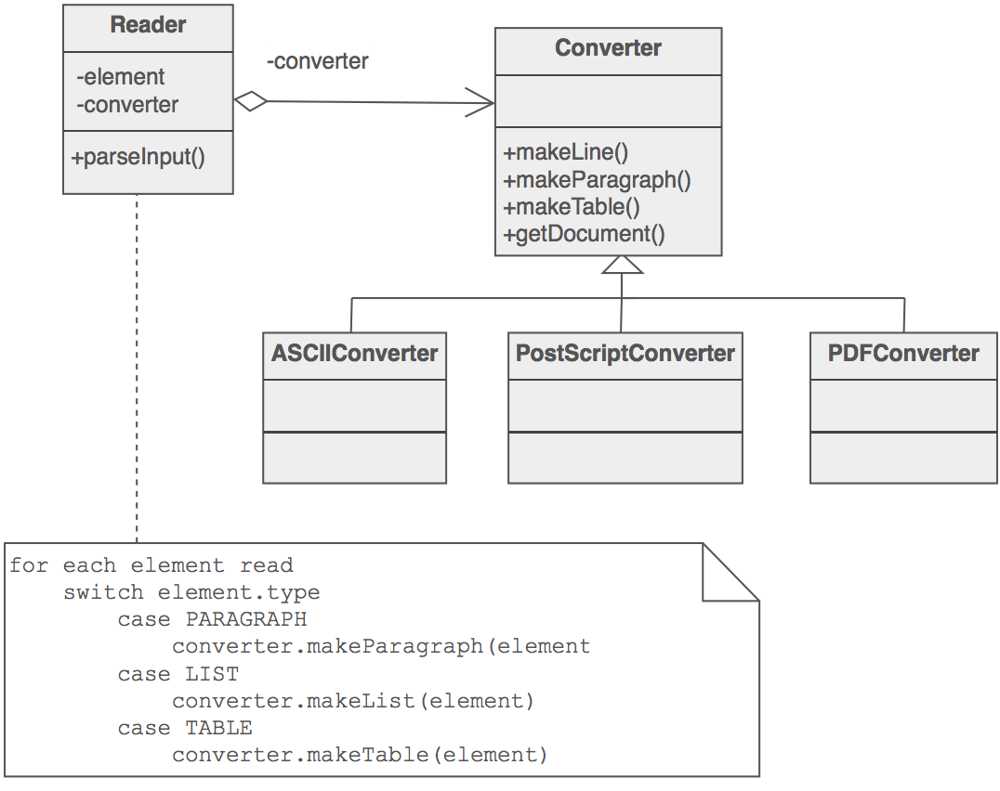

# 生成器模式

### 目的

- 将复杂对象的构造与其表示分开, 以便相同的构造过程可以创建不同的表示.
- 解析复杂表示, 创建多个目标之一.

### 问题

应用程序需要创建复杂聚合的元素. 但聚合规范存在于其他地方, 并且需要在主结构中构建它们.

### 讨论
将用于解释(即, 读取和解析)存储的持久性机制(例如, RTF文件)的算法与用于构建和表示许多目标产品(例如, ASCII, TeX, 文本小部件)之一的算法分开. 重点区别在于创建复杂的聚合.

"重点"在解释外部格式时调用"builder"服务. "构建器"在每次调用时都会创建复杂对象的一部分, 并维护所有中间状态. 产品完成后, 客户端将从"构建器"中检索结果.

提供对施工过程的更好控制. 与一次构建产品的创建模式不同, Builder模式在"director"的控制下逐步构建产品.

### 结构

Reader封装了对公共输入的解析. Builder层次结构使得许多特殊表示或目标的多态创建成为可能.



### 示例

Builder模式将复杂对象的构造与其表示分开, 以便相同的构造过程可以创建不同的表示. 快餐店使用这种模式来构建儿童餐. 儿童餐通常包括主要食品, 副食品, 饮料和玩具(例如, 汉堡包, 薯条, 可乐和玩具恐龙). 请注意, 儿童膳食的含量可能会有所不同, 但施工过程是一样的. 无论客户订购汉堡包, 芝士汉堡还是鸡肉, 过程都是一样的. 柜台的员工指示船员组装主要物品, 副物品和玩具. 然后将这些物品放入袋中. 将饮料放入杯中并保持在袋外. 在竞争的餐馆使用相同的过程.


### 检查清单

1. Decide if a common input and many possible representations (or outputs) is the problem at hand.
2. Encapsulate the parsing of the common input in a Reader class.
3. Design a standard protocol for creating all possible output representations. Capture the steps of this protocol in a Builder interface.
4. Define a Builder derived class for each target representation.
5. The client creates a Reader object and a Builder object, and registers the latter with the former.
6. The client asks the Reader to "construct".
7. The client asks the Builder to return the result.

### 经验法则

Sometimes creational patterns are complementary: Builder can use one of the other patterns to implement which components get built. Abstract Factory, Builder, and Prototype can use Singleton in their implementations.
Builder focuses on constructing a complex object step by step. Abstract Factory emphasizes a family of product objects (either simple or complex). Builder returns the product as a final step, but as far as the Abstract Factory is concerned, the product gets returned immediately.
Builder often builds a Composite.
Often, designs start out using Factory Method (less complicated, more customizable, subclasses proliferate) and evolve toward Abstract Factory, Prototype, or Builder (more flexible, more complex) as the designer discovers where more flexibility is needed.

### Code

```python
"""
Separate the construction of a complex object from its representation so
that the same construction process can create different representations.
"""

import abc


class Director:
    """
    Construct an object using the Builder interface.
    """

    def __init__(self):
        self._builder = None

    def construct(self, builder):
        self._builder = builder
        self._builder._build_part_a()
        self._builder._build_part_b()
        self._builder._build_part_c()


class Builder(metaclass=abc.ABCMeta):
    """
    Specify an abstract interface for creating parts of a Product
    object.
    """

    def __init__(self):
        self.product = Product()

    @abc.abstractmethod
    def _build_part_a(self):
        pass

    @abc.abstractmethod
    def _build_part_b(self):
        pass

    @abc.abstractmethod
    def _build_part_c(self):
        pass


class ConcreteBuilder(Builder):
    """
    Construct and assemble parts of the product by implementing the
    Builder interface.
    Define and keep track of the representation it creates.
    Provide an interface for retrieving the product.
    """

    def _build_part_a(self):
        pass

    def _build_part_b(self):
        pass

    def _build_part_c(self):
        pass


class Product:
    """
    Represent the complex object under construction.
    """

    pass


def main():
    concrete_builder = ConcreteBuilder()
    director = Director()
    director.construct(concrete_builder)
    product = concrete_builder.product


if __name__ == "__main__":
    main()
```