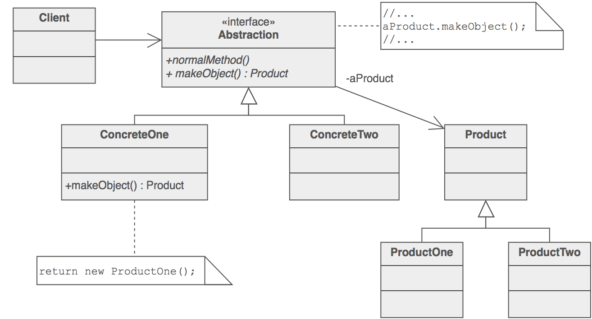
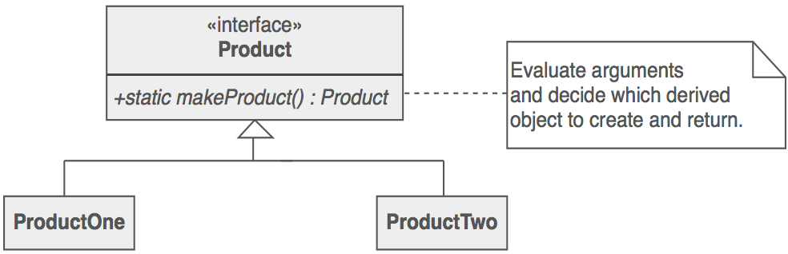
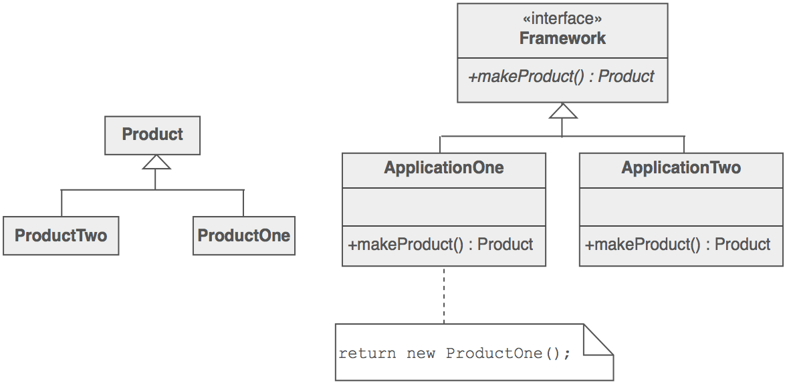
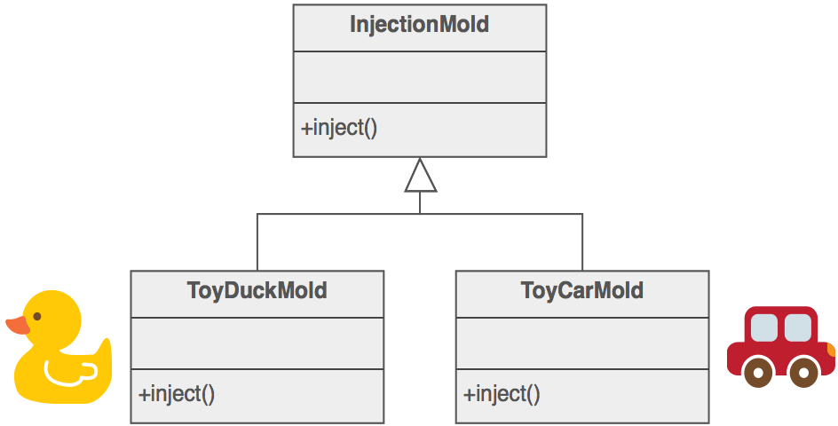

# 工厂方法模式

### 目的

- 定义用于创建对象的接口, 但让子类决定实例化哪个类. Factory Method 允许类将实例化延迟到子类.
- 定义“虚拟”构造函数.
- new 操作符是有害的.

### 问题

框架需要为一系列应用程序标准化体系结构模型, 但允许各个应用程序定义自己的域对象并提供其实例化.

### 讨论

工厂方法是创建对象, 因为模板方法是实现算法. 超类指定所有标准和通用行为(使用纯虚拟"占位符"进行创建步骤), 然后将创建详细信息委托给客户端提供的子类.

工厂方法使设计更具可定制性, 而且更复杂一些. 其他设计模式需要新类, 而工厂方法仅需要新操作.

人们经常使用工厂方法作为创建对象的标准方法; 但是, 如果实例化的类永远不会更改, 或者实例化发生在子类可以轻松覆盖的操作(例如初始化操作)中, 则没有必要.

工厂方法类似于抽象工厂, 但没有强调家庭.

工厂方法通常由架构框架指定, 然后由框架的用户实现.

### 结构

"四人帮"(下文)中讨论的工厂方法的实施与抽象工厂的实施大致重叠. 出于这个原因, 本章的介绍侧重于自那时以来流行的方法.



工厂方法越来越流行的定义是: 类的静态方法, 它返回该类类型的对象. 但与构造函数不同, 它返回的实际对象可能是子类的实例. 与构造函数不同, 可以重用现有对象, 而不是创建新对象. 与构造函数不同, 工厂方法可以具有不同的和更具描述性的名称(例如Color.make_RGB_color(浮动红色, 浮动绿色, 浮动蓝色)和Color.make_HSB_color(浮动色调, 浮动饱和度, 浮动亮度)


客户端完全与派生类的实现细节分离. 现在可以进行多态创建.



### 示例

工厂方法定义了一个用于创建对象的接口, 但是让子类决定要实例化哪些类. 注塑机展示了这种模式. 塑料玩具制造商加工塑料模塑粉末, 并将塑料注入所需形状的模具中. 玩具类(汽车, 动作人物等)由模具决定.



### 检查清单

1. 如果您具有执行多态的继承层次结构, 请考虑通过在基类中定义静态工厂方法来添加多态创建功能.
2. 设计工厂方法的参数. 什么样的特性或特征是必要的, 足以识别正确的派生类来实例化?
3. 考虑设计一个内部"对象池", 它允许重用对象而不是从头开始创建对象.
4. 考虑将所有构造函数设为私有或受保护.

### 经验法则

- 抽象工厂类通常使用工厂方法实现, 但它们可以使用原型模式实现.
- 工厂方法通常在模板方法中调用.
- 工厂方法: 通过继承创建.原型: 通过授权创建.
- 通常, 设计开始使用工厂方法(不太复杂, 可定制, 子类增加), 并逐渐向抽象工厂, 原型或构建器(更灵活, 更复杂)发展, 因为设计师发现需要更多灵活性的地方.
- 原型模式不需要子类化, 但它确实需要初始化操作. 工厂方法需要子类化, 但不需要初始化.
- 工厂方法的优点是它可以多次返回同一个实例, 或者可以返回一个子类而不是那个确切类型的对象.
- 一些工厂方法倡导者建议, 作为语言设计的问题(或者说, 作为一种风格), 所有的构造者都应该是私有的或受到保护的. 无论是制造新物体还是回收旧物体, 这都不是别人的事.
- New 方法认为是有害的. 请求对象和创建对象之间存在差异. New 运算符始终创建对象, 并且无法封装对象创建. 工厂方法强制执行封装, 并允许请求对象, 而不会与创建行为进行不可分割的耦合.

### Code

```python
"""
Define an interface for creating an object, but let subclasses decide
which class to instantiate. Factory Method lets a class defer
instantiation to subclasses.
"""

import abc


class Creator(metaclass=abc.ABCMeta):
    """
    Declare the factory method, which returns an object of type Product.
    Creator may also define a default implementation of the factory
    method that returns a default ConcreteProduct object.
    Call the factory method to create a Product object.
    """

    def __init__(self):
        self.product = self._factory_method()

    @abc.abstractmethod
    def _factory_method(self):
        pass

    def some_operation(self):
        self.product.interface()


class ConcreteCreator1(Creator):
    """
    Override the factory method to return an instance of a
    ConcreteProduct1.
    """

    def _factory_method(self):
        return ConcreteProduct1()


class ConcreteCreator2(Creator):
    """
    Override the factory method to return an instance of a
    ConcreteProduct2.
    """

    def _factory_method(self):
        return ConcreteProduct2()


class Product(metaclass=abc.ABCMeta):
    """
    Define the interface of objects the factory method creates.
    """

    @abc.abstractmethod
    def interface(self):
        pass


class ConcreteProduct1(Product):
    """
    Implement the Product interface.
    """

    def interface(self):
        pass


class ConcreteProduct2(Product):
    """
    Implement the Product interface.
    """

    def interface(self):
        pass


def main():
    concrete_creator = ConcreteCreator1()
    concrete_creator.product.interface()
    concrete_creator.some_operation()


if __name__ == "__main__":
    main()
```