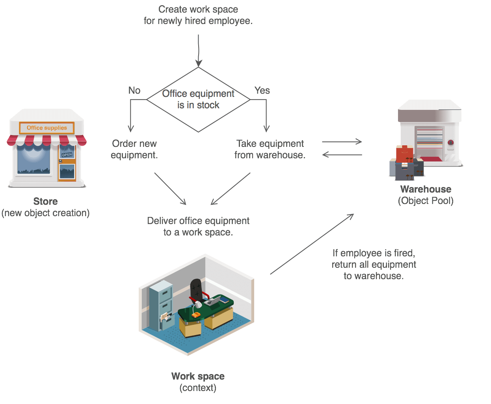

### 对象池模式

### 目的

Object pooling can offer a significant performance boost; it is most effective in situations where the cost of initializing a class instance is high, the rate of instantiation of a class is high, and the number of instantiations in use at any one time is low.

### 问题

Object pools (otherwise known as resource pools) are used to manage the object caching. A client with access to a Object pool can avoid creating a new Objects by simply asking the pool for one that has already been instantiated instead. Generally the pool will be a growing pool, i.e. the pool itself will create new objects if the pool is empty, or we can have a pool, which restricts the number of objects created.

It is desirable to keep all Reusable objects that are not currently in use in the same object pool so that they can be managed by one coherent policy. To achieve this, the Reusable Pool class is designed to be a singleton class.

### 讨论

The Object Pool lets others "check out" objects from its pool, when those objects are no longer needed by their processes, they are returned to the pool in order to be reused.

However, we don't want a process to have to wait for a particular object to be released, so the Object Pool also instantiates new objects as they are required, but must also implement a facility to clean up unused objects periodically.

### 结构

The general idea for the Connection Pool pattern is that if instances of a class can be reused, you avoid creating instances of the class by reusing them.


Reusable - Instances of classes in this role collaborate with other objects for a limited amount of time, then they are no longer needed for that collaboration.
Client - Instances of classes in this role use Reusable objects.
ReusablePool - Instances of classes in this role manage Reusable objects for use by Client objects.
Usually, it is desirable to keep all Reusable objects that are not currently in use in the same object pool so that they can be managed by one coherent policy. To achieve this, the ReusablePool class is designed to be a singleton class. Its constructor(s) are private, which forces other classes to call its getInstance method to get the one instance of the ReusablePool class.

A Client object calls a ReusablePool object's acquireReusable method when it needs a Reusable object. A ReusablePool object maintains a collection of Reusable objects. It uses the collection of Reusable objects to contain a pool of Reusable objects that are not currently in use.

If there are any Reusable objects in the pool when the acquireReusable method is called, it removes a Reusable object from the pool and returns it. If the pool is empty, then the acquireReusable method creates a Reusable object if it can. If the acquireReusable method cannot create a new Reusable object, then it waits until a Reusable object is returned to the collection.

Client objects pass a Reusable object to a ReusablePool object's releaseReusable method when they are finished with the object. The releaseReusable method returns a Reusable object to the pool of Reusable objects that are not in use.

In many applications of the Object Pool pattern, there are reasons for limiting the total number of Reusable objects that may exist. In such cases, the ReusablePool object that creates Reusable objects is responsible for not creating more than a specified maximum number of Reusable objects. If ReusablePool objects are responsible for limiting the number of objects they will create, then the ReusablePool class will have a method for specifying the maximum number of objects to be created. That method is indicated in the above diagram as setMaxPoolSize.

### 示例

Object pool pattern is similar to an office warehouse. When a new employee is hired, office manager has to prepare a work space for him. She figures whether or not there's a spare equipment in the office warehouse. If so, she uses it. If not, she places an order to purchase new equipment from Amazon. In case if an employee is fired, his equipment is moved to warehouse, where it could be taken when new work place will be needed.



### 检查清单

1. Create ObjectPool class with private array of Objects inside
2. Create acquire and release methods in ObjectPool class
3. Make sure that your ObjectPool is Singleton

### 经验法则

- The Factory Method pattern can be used to encapsulate the creation logic for objects. However, it does not manage them after their creation, the object pool pattern keeps track of the objects it creates.
- Object Pools are usually implemented as Singletons.

### Code

```python
"""
Offer a significant performance boost; it is most effective in
situations where the cost of initializing a class instance is high, the
rate of instantiation of a class is high, and the number of
instantiations in use at any one time is low.
"""


class ReusablePool:
    """
    Manage Reusable objects for use by Client objects.
    """

    def __init__(self, size):
        self._reusables = [Reusable() for _ in range(size)]

    def acquire(self):
        return self._reusables.pop()

    def release(self, reusable):
        self._reusables.append(reusable)


class Reusable:
    """
    Collaborate with other objects for a limited amount of time, then
    they are no longer needed for that collaboration.
    """

    pass


def main():
    reusable_pool = ReusablePool(10)
    reusable = reusable_pool.acquire()
    reusable_pool.release(reusable)


if __name__ == "__main__":
    main()
```